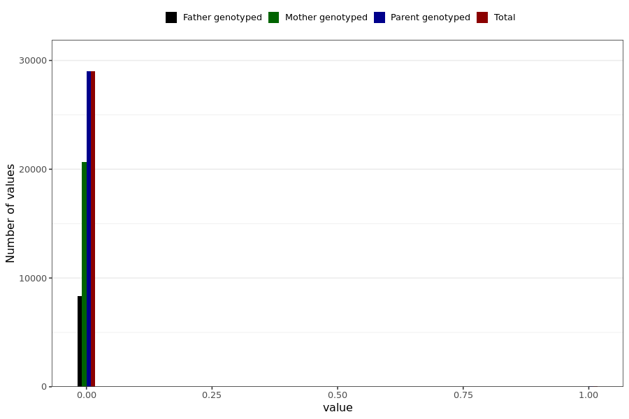

# corona_vaccine_perikardite_last_dose
- Number of values:

| Value | Total | Child genotyped | Mother genotyped | Father genotyped | Parents genotyped |
| ----- | ----- | --------------- | ---------------- | ---------------- |---------------- |
| Missing | 201970 | 83470 | 66956 | 51544 | 118500 |
| Non-missing | 29019 | 0 | 20689 | 8330 | 29019 |

| Value | Total | Child genotyped | Mother genotyped | Father genotyped | Parents genotyped |
| ----- | ----- | --------------- | ---------------- | ---------------- |---------------- |
| 0 | 28990 | 0 | 20669 | 8321 | 28990 |
| 1 | 29 | 0 | 20 | 9 | 29 |

