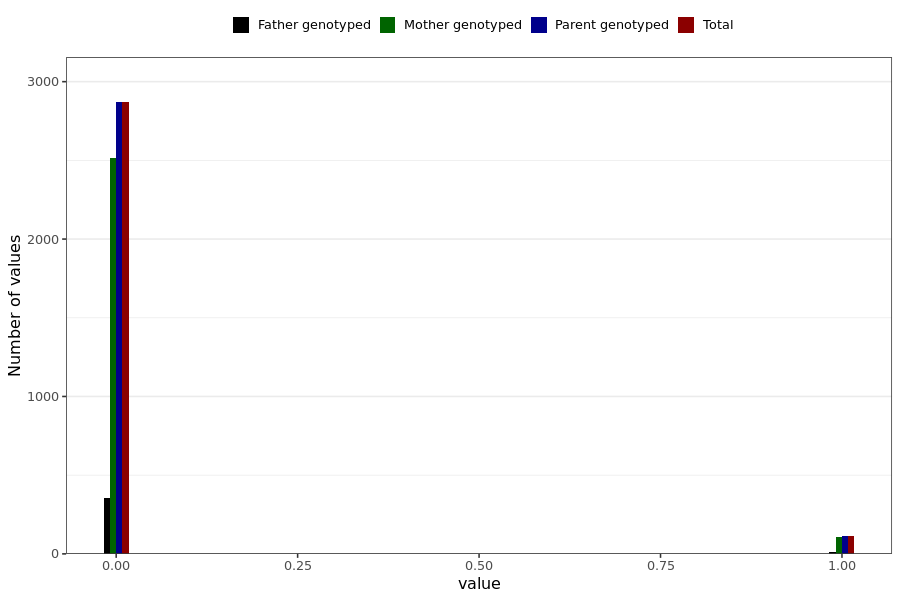

# corona_vaccine_rash_not_at_injection_site_after_asz
- Number of values:

| Value | Total | Child genotyped | Mother genotyped | Father genotyped | Parents genotyped |
| ----- | ----- | --------------- | ---------------- | ---------------- |---------------- |
| Missing | 228005 | 83470 | 85023 | 59512 | 144535 |
| Non-missing | 2984 | 0 | 2622 | 362 | 2984 |

| Value | Total | Child genotyped | Mother genotyped | Father genotyped | Parents genotyped |
| ----- | ----- | --------------- | ---------------- | ---------------- |---------------- |
| 0 | 2869 | 0 | 2516 | 353 | 2869 |
| 1 | 115 | 0 | 106 | 9 | 115 |

