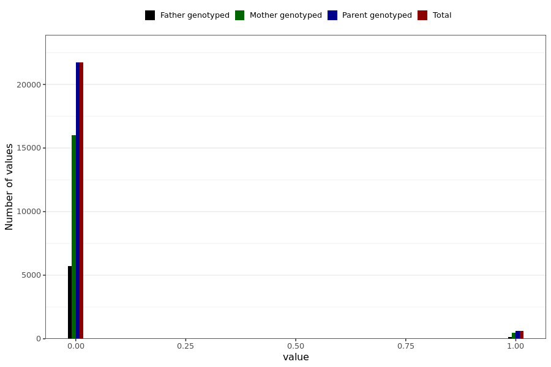

# corona_vaccine_rash_not_at_injection_site_after_bnt
- Number of values:

| Value | Total | Child genotyped | Mother genotyped | Father genotyped | Parents genotyped |
| ----- | ----- | --------------- | ---------------- | ---------------- |---------------- |
| Missing | 208670 | 83470 | 71166 | 54034 | 125200 |
| Non-missing | 22319 | 0 | 16479 | 5840 | 22319 |

| Value | Total | Child genotyped | Mother genotyped | Father genotyped | Parents genotyped |
| ----- | ----- | --------------- | ---------------- | ---------------- |---------------- |
| 0 | 21719 | 0 | 16004 | 5715 | 21719 |
| 1 | 600 | 0 | 475 | 125 | 600 |

