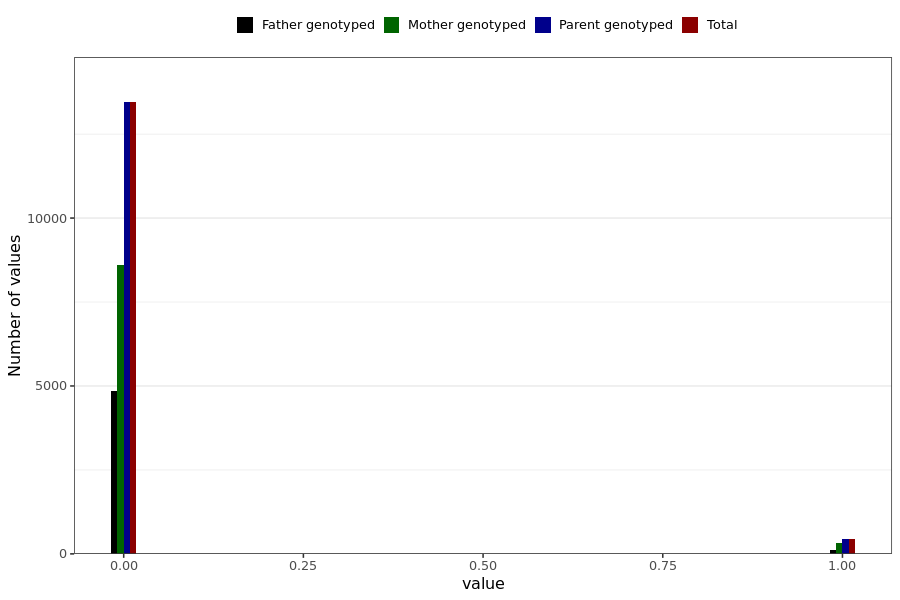

# corona_vaccine_rash_not_at_injection_site_after_mod
- Number of values:

| Value | Total | Child genotyped | Mother genotyped | Father genotyped | Parents genotyped |
| ----- | ----- | --------------- | ---------------- | ---------------- |---------------- |
| Missing | 217088 | 83470 | 78714 | 54904 | 133618 |
| Non-missing | 13901 | 0 | 8931 | 4970 | 13901 |

| Value | Total | Child genotyped | Mother genotyped | Father genotyped | Parents genotyped |
| ----- | ----- | --------------- | ---------------- | ---------------- |---------------- |
| 0 | 13448 | 0 | 8605 | 4843 | 13448 |
| 1 | 453 | 0 | 326 | 127 | 453 |

