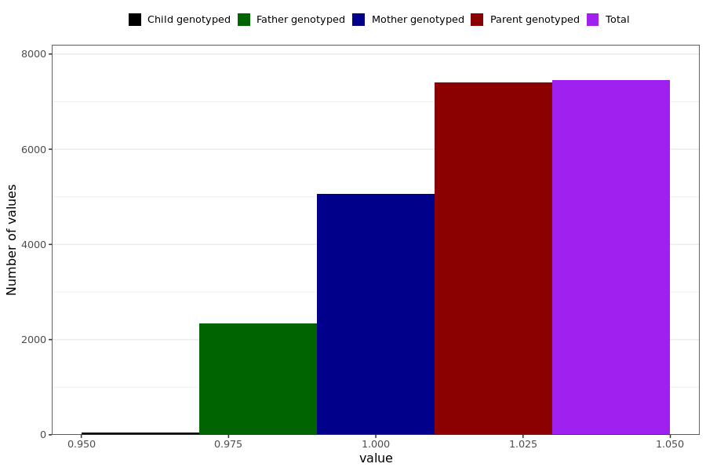

# cough
- Number of values:

| Value | Total | Child genotyped | Mother genotyped | Father genotyped | Parents genotyped |
| ----- | ----- | --------------- | ---------------- | ---------------- |---------------- |
| Missing | 223541 | 83423 | 82582 | 57536 | 140118 |
| Non-missing | 7448 | 47 | 5063 | 2338 | 7401 |

| Value | Total | Child genotyped | Mother genotyped | Father genotyped | Parents genotyped |
| ----- | ----- | --------------- | ---------------- | ---------------- |---------------- |
| 1 | 7448 | 47 | 5063 | 2338 | 7401 |

