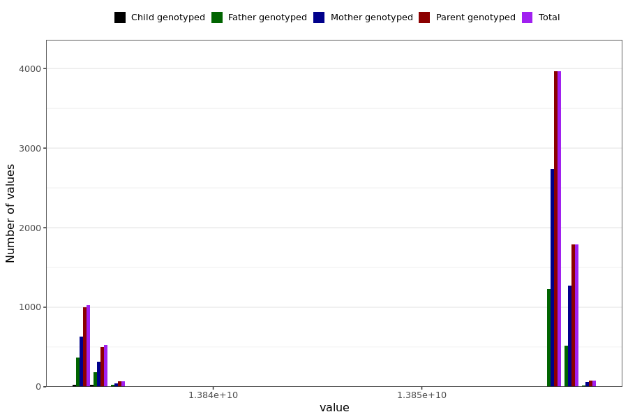

# cough_last_reported
- Number of values:

| Value | Total | Child genotyped | Mother genotyped | Father genotyped | Parents genotyped |
| ----- | ----- | --------------- | ---------------- | ---------------- |---------------- |
| Missing | 223541 | 83423 | 82582 | 57536 | 140118 |
| Non-missing | 7448 | 47 | 5063 | 2338 | 7401 |

| Value | Total | Child genotyped | Mother genotyped | Father genotyped | Parents genotyped |
| ----- | ----- | --------------- | ---------------- | ---------------- |---------------- |
| 25th percentile | 13856572800 | 13834022400 | 13856572800 | 13856572800 | 13856572800 |
| 50th percentile | 13856572800 | 13834108800 | 13856572800 | 13856572800 | 13856572800 |
| 75th percentile | 13856745600 | 13834886400 | 13856745600 | 13856659200 | 13856745600 |

