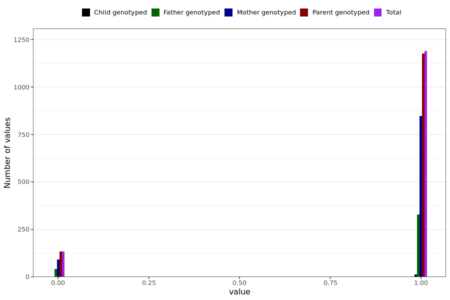

# cough_short
- Number of values:

| Value | Total | Child genotyped | Mother genotyped | Father genotyped | Parents genotyped |
| ----- | ----- | --------------- | ---------------- | ---------------- |---------------- |
| Missing | 229667 | 83457 | 86707 | 59503 | 146210 |
| Non-missing | 1322 | 13 | 938 | 371 | 1309 |

| Value | Total | Child genotyped | Mother genotyped | Father genotyped | Parents genotyped |
| ----- | ----- | --------------- | ---------------- | ---------------- |---------------- |
| 0 | 133 | 0 | 91 | 42 | 133 |
| 1 | 1189 | 13 | 847 | 329 | 1176 |

