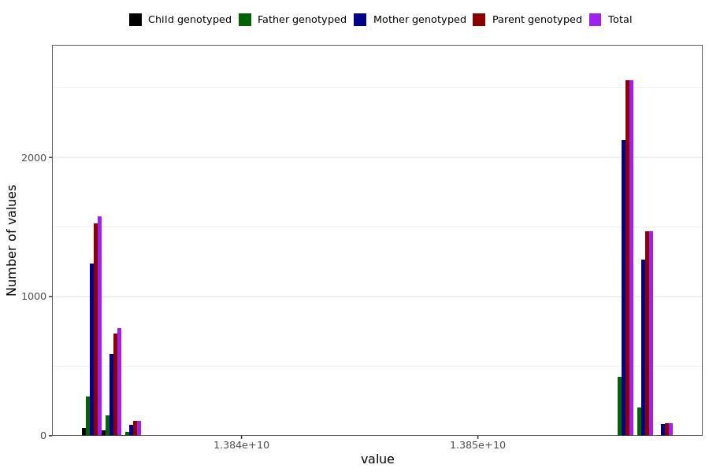

# dizziness_last_reported
- Number of values:

| Value | Total | Child genotyped | Mother genotyped | Father genotyped | Parents genotyped |
| ----- | ----- | --------------- | ---------------- | ---------------- |---------------- |
| Missing | 224425 | 83375 | 82266 | 58784 | 141050 |
| Non-missing | 6564 | 95 | 5379 | 1090 | 6469 |

| Value | Total | Child genotyped | Mother genotyped | Father genotyped | Parents genotyped |
| ----- | ----- | --------------- | ---------------- | ---------------- |---------------- |
| 25th percentile | 13834108800 | 13834022400 | 13834108800 | 13834022400 | 13834108800 |
| 50th percentile | 13856572800 | 13834022400 | 13856572800 | 13856572800 | 13856572800 |
| 75th percentile | 13856572800 | 13834843200 | 13856659200 | 13856572800 | 13856572800 |

