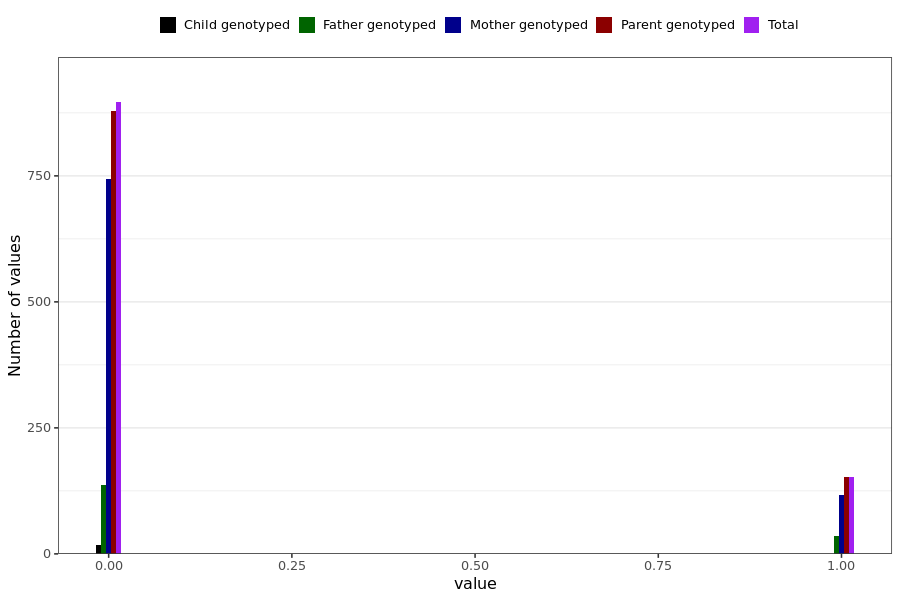

# dizziness_long
- Number of values:

| Value | Total | Child genotyped | Mother genotyped | Father genotyped | Parents genotyped |
| ----- | ----- | --------------- | ---------------- | ---------------- |---------------- |
| Missing | 229940 | 83453 | 86785 | 59702 | 146487 |
| Non-missing | 1049 | 17 | 860 | 172 | 1032 |

| Value | Total | Child genotyped | Mother genotyped | Father genotyped | Parents genotyped |
| ----- | ----- | --------------- | ---------------- | ---------------- |---------------- |
| 0 | 896 | 17 | 743 | 136 | 879 |
| 1 | 153 | 0 | 117 | 36 | 153 |

