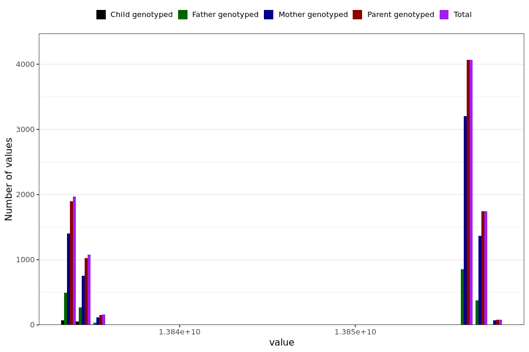

# fatigue_last_reported
- Number of values:

| Value | Total | Child genotyped | Mother genotyped | Father genotyped | Parents genotyped |
| ----- | ----- | --------------- | ---------------- | ---------------- |---------------- |
| Missing | 221891 | 83345 | 80718 | 57828 | 138546 |
| Non-missing | 9098 | 125 | 6927 | 2046 | 8973 |

| Value | Total | Child genotyped | Mother genotyped | Father genotyped | Parents genotyped |
| ----- | ----- | --------------- | ---------------- | ---------------- |---------------- |
| 25th percentile | 13834108800 | 13834022400 | 13834454400 | 13834108800 | 13834195200 |
| 50th percentile | 13856572800 | 13834022400 | 13856572800 | 13856572800 | 13856572800 |
| 75th percentile | 13856572800 | 13834886400 | 13856659200 | 13856572800 | 13856572800 |

