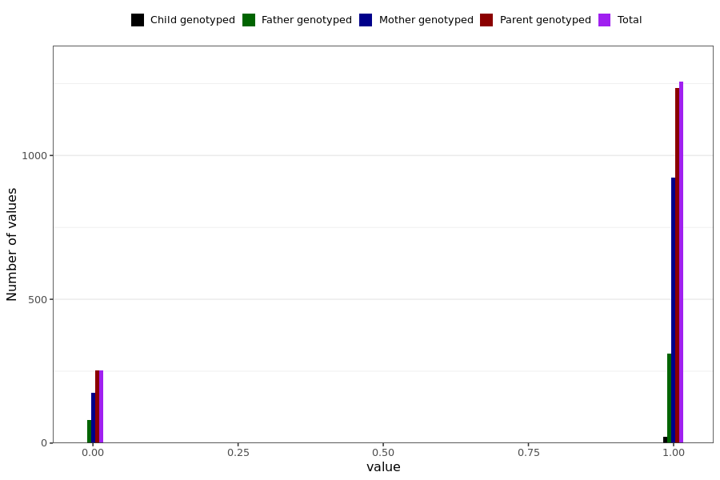

# fatigue_short
- Number of values:

| Value | Total | Child genotyped | Mother genotyped | Father genotyped | Parents genotyped |
| ----- | ----- | --------------- | ---------------- | ---------------- |---------------- |
| Missing | 229479 | 83448 | 86546 | 59485 | 146031 |
| Non-missing | 1510 | 22 | 1099 | 389 | 1488 |

| Value | Total | Child genotyped | Mother genotyped | Father genotyped | Parents genotyped |
| ----- | ----- | --------------- | ---------------- | ---------------- |---------------- |
| 0 | 254 | 0 | 175 | 79 | 254 |
| 1 | 1256 | 22 | 924 | 310 | 1234 |

