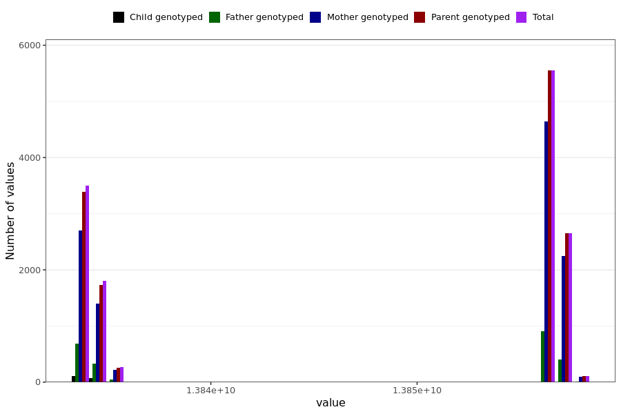

# headache_last_reported
- Number of values:

| Value | Total | Child genotyped | Mother genotyped | Father genotyped | Parents genotyped |
| ----- | ----- | --------------- | ---------------- | ---------------- |---------------- |
| Missing | 217106 | 83274 | 76345 | 57487 | 133832 |
| Non-missing | 13883 | 196 | 11300 | 2387 | 13687 |

| Value | Total | Child genotyped | Mother genotyped | Father genotyped | Parents genotyped |
| ----- | ----- | --------------- | ---------------- | ---------------- |---------------- |
| 25th percentile | 13834022400 | 13834022400 | 13834108800 | 13834022400 | 13834108800 |
| 50th percentile | 13856572800 | 13834022400 | 13856572800 | 13856572800 | 13856572800 |
| 75th percentile | 13856572800 | 13834886400 | 13856572800 | 13856572800 | 13856572800 |

