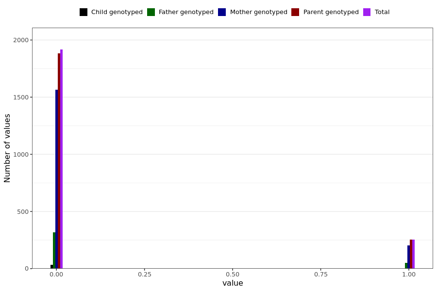

# headache_long
- Number of values:

| Value | Total | Child genotyped | Mother genotyped | Father genotyped | Parents genotyped |
| ----- | ----- | --------------- | ---------------- | ---------------- |---------------- |
| Missing | 228819 | 83437 | 85879 | 59503 | 145382 |
| Non-missing | 2170 | 33 | 1766 | 371 | 2137 |

| Value | Total | Child genotyped | Mother genotyped | Father genotyped | Parents genotyped |
| ----- | ----- | --------------- | ---------------- | ---------------- |---------------- |
| 0 | 1916 | 33 | 1564 | 319 | 1883 |
| 1 | 254 | 0 | 202 | 52 | 254 |

