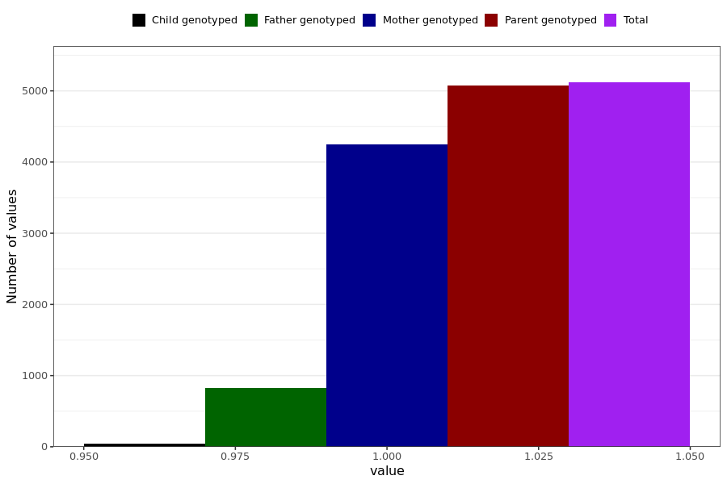

# heart_palpitation
- Number of values:

| Value | Total | Child genotyped | Mother genotyped | Father genotyped | Parents genotyped |
| ----- | ----- | --------------- | ---------------- | ---------------- |---------------- |
| Missing | 225872 | 83431 | 83397 | 59044 | 142441 |
| Non-missing | 5117 | 39 | 4248 | 830 | 5078 |

| Value | Total | Child genotyped | Mother genotyped | Father genotyped | Parents genotyped |
| ----- | ----- | --------------- | ---------------- | ---------------- |---------------- |
| 1 | 5117 | 39 | 4248 | 830 | 5078 |

