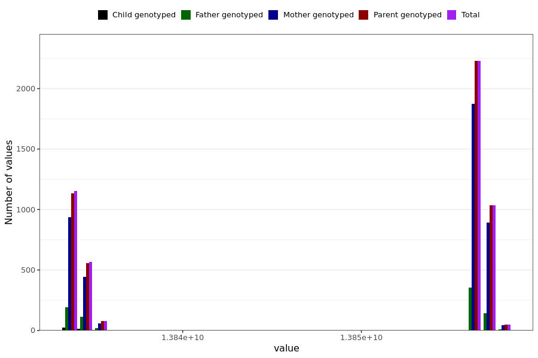

# heart_palpitation_last_reported
- Number of values:

| Value | Total | Child genotyped | Mother genotyped | Father genotyped | Parents genotyped |
| ----- | ----- | --------------- | ---------------- | ---------------- |---------------- |
| Missing | 225872 | 83431 | 83397 | 59044 | 142441 |
| Non-missing | 5117 | 39 | 4248 | 830 | 5078 |

| Value | Total | Child genotyped | Mother genotyped | Father genotyped | Parents genotyped |
| ----- | ----- | --------------- | ---------------- | ---------------- |---------------- |
| 25th percentile | 13834108800 | 13834022400 | 13834108800 | 13834108800 | 13834108800 |
| 50th percentile | 13856572800 | 13834022400 | 13856572800 | 13856572800 | 13856572800 |
| 75th percentile | 13856659200 | 13834886400 | 13856659200 | 13856572800 | 13856659200 |

