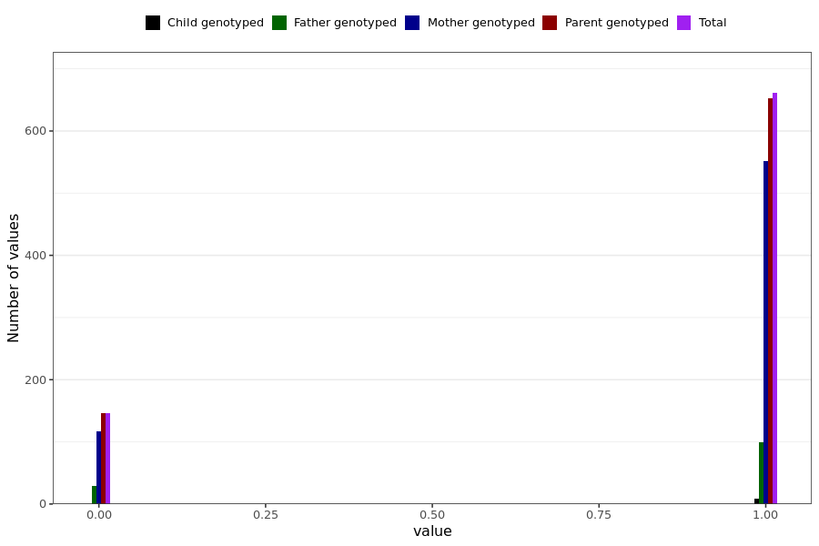

# heart_palpitation_short
- Number of values:

| Value | Total | Child genotyped | Mother genotyped | Father genotyped | Parents genotyped |
| ----- | ----- | --------------- | ---------------- | ---------------- |---------------- |
| Missing | 230182 | 83461 | 86976 | 59745 | 146721 |
| Non-missing | 807 | 9 | 669 | 129 | 798 |

| Value | Total | Child genotyped | Mother genotyped | Father genotyped | Parents genotyped |
| ----- | ----- | --------------- | ---------------- | ---------------- |---------------- |
| 0 | 146 | 0 | 117 | 29 | 146 |
| 1 | 661 | 9 | 552 | 100 | 652 |

