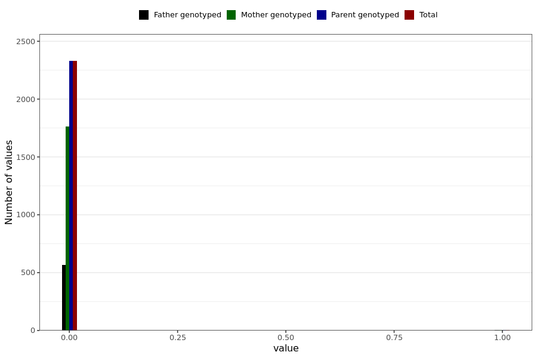

# influenza_vaccine_blood_clot
- Number of values:

| Value | Total | Child genotyped | Mother genotyped | Father genotyped | Parents genotyped |
| ----- | ----- | --------------- | ---------------- | ---------------- |---------------- |
| Missing | 228656 | 83470 | 85881 | 59305 | 145186 |
| Non-missing | 2333 | 0 | 1764 | 569 | 2333 |

| Value | Total | Child genotyped | Mother genotyped | Father genotyped | Parents genotyped |
| ----- | ----- | --------------- | ---------------- | ---------------- |---------------- |
| 0 | 2329 | 0 | 1762 | 567 | 2329 |
| 1 | 4 | 0 | 2 | 2 | 4 |

