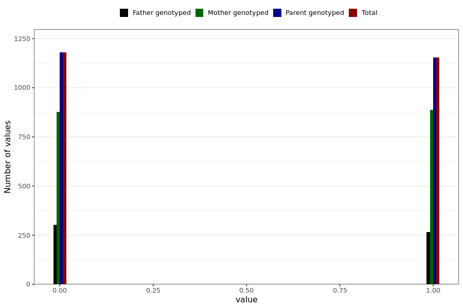

# influenza_vaccine_chills
- Number of values:

| Value | Total | Child genotyped | Mother genotyped | Father genotyped | Parents genotyped |
| ----- | ----- | --------------- | ---------------- | ---------------- |---------------- |
| Missing | 228656 | 83470 | 85881 | 59305 | 145186 |
| Non-missing | 2333 | 0 | 1764 | 569 | 2333 |

| Value | Total | Child genotyped | Mother genotyped | Father genotyped | Parents genotyped |
| ----- | ----- | --------------- | ---------------- | ---------------- |---------------- |
| 0 | 1179 | 0 | 877 | 302 | 1179 |
| 1 | 1154 | 0 | 887 | 267 | 1154 |

