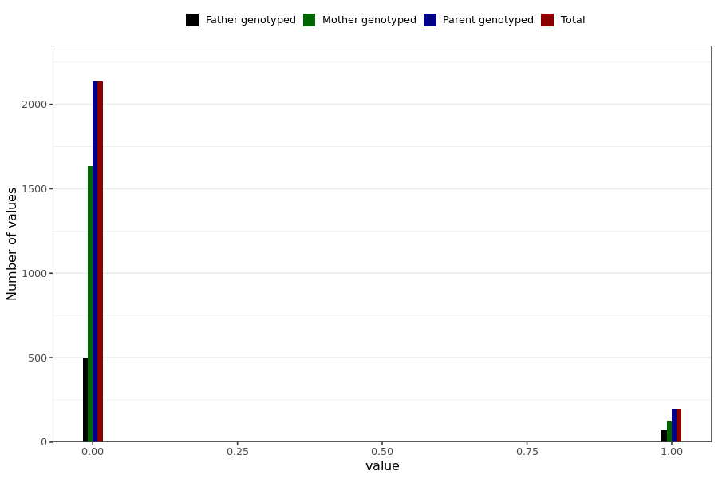

# influenza_vaccine_difficulty_breathing
- Number of values:

| Value | Total | Child genotyped | Mother genotyped | Father genotyped | Parents genotyped |
| ----- | ----- | --------------- | ---------------- | ---------------- |---------------- |
| Missing | 228656 | 83470 | 85881 | 59305 | 145186 |
| Non-missing | 2333 | 0 | 1764 | 569 | 2333 |

| Value | Total | Child genotyped | Mother genotyped | Father genotyped | Parents genotyped |
| ----- | ----- | --------------- | ---------------- | ---------------- |---------------- |
| 0 | 2134 | 0 | 1636 | 498 | 2134 |
| 1 | 199 | 0 | 128 | 71 | 199 |

