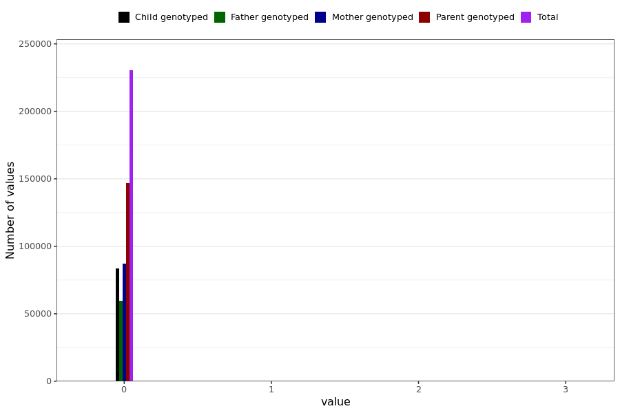

# long_covid_factor2
- Number of values:

| Value | Total | Child genotyped | Mother genotyped | Father genotyped | Parents genotyped |
| ----- | ----- | --------------- | ---------------- | ---------------- |---------------- |
| Missing | 0 | 0 | 0 | 0 | 0 |
| Non-missing | 230989 | 83470 | 87645 | 59874 | 147519 |

| Value | Total | Child genotyped | Mother genotyped | Father genotyped | Parents genotyped |
| ----- | ----- | --------------- | ---------------- | ---------------- |---------------- |
| 25th percentile | 0 | 0 | 0 | 0 | 0 |
| 50th percentile | 0 | 0 | 0 | 0 | 0 |
| 75th percentile | 0 | 0 | 0 | 0 | 0 |

