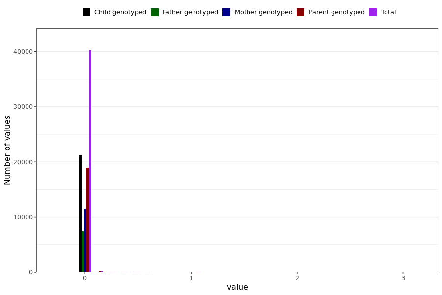

# long_covid_factor2_vs_recovered
- Number of values:

| Value | Total | Child genotyped | Mother genotyped | Father genotyped | Parents genotyped |
| ----- | ----- | --------------- | ---------------- | ---------------- |---------------- |
| Missing | 190107 | 62196 | 75724 | 52187 | 127911 |
| Non-missing | 40882 | 21274 | 11921 | 7687 | 19608 |

| Value | Total | Child genotyped | Mother genotyped | Father genotyped | Parents genotyped |
| ----- | ----- | --------------- | ---------------- | ---------------- |---------------- |
| 25th percentile | 0 | 0 | 0 | 0 | 0 |
| 50th percentile | 0 | 0 | 0 | 0 | 0 |
| 75th percentile | 0 | 0 | 0 | 0 | 0 |

