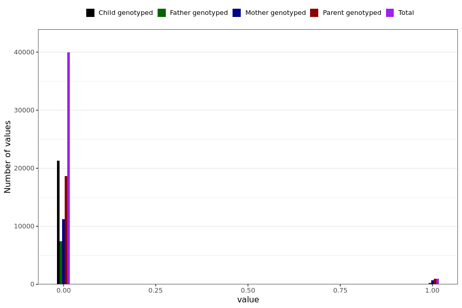

# long_covid_vs_recovered
- Number of values:

| Value | Total | Child genotyped | Mother genotyped | Father genotyped | Parents genotyped |
| ----- | ----- | --------------- | ---------------- | ---------------- |---------------- |
| Missing | 190107 | 62196 | 75724 | 52187 | 127911 |
| Non-missing | 40882 | 21274 | 11921 | 7687 | 19608 |

| Value | Total | Child genotyped | Mother genotyped | Father genotyped | Parents genotyped |
| ----- | ----- | --------------- | ---------------- | ---------------- |---------------- |
| 0 | 39937 | 21271 | 11254 | 7412 | 18666 |
| 1 | 945 | 3 | 667 | 275 | 942 |

