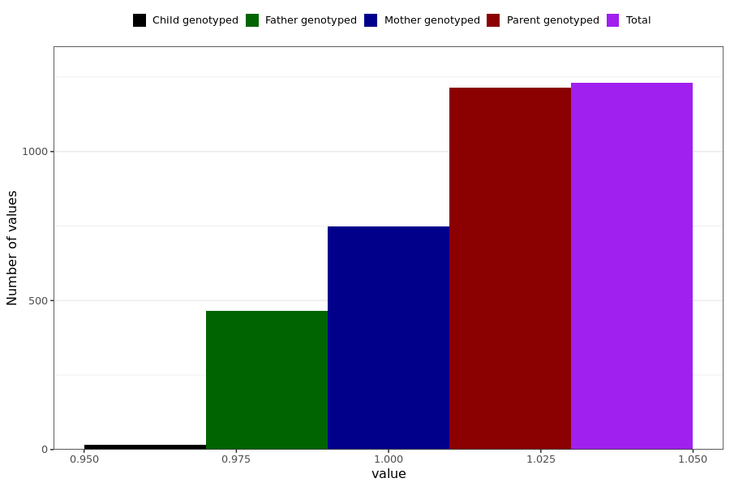

# lung_function_reduced
- Number of values:

| Value | Total | Child genotyped | Mother genotyped | Father genotyped | Parents genotyped |
| ----- | ----- | --------------- | ---------------- | ---------------- |---------------- |
| Missing | 229759 | 83455 | 86895 | 59409 | 146304 |
| Non-missing | 1230 | 15 | 750 | 465 | 1215 |

| Value | Total | Child genotyped | Mother genotyped | Father genotyped | Parents genotyped |
| ----- | ----- | --------------- | ---------------- | ---------------- |---------------- |
| 1 | 1230 | 15 | 750 | 465 | 1215 |

