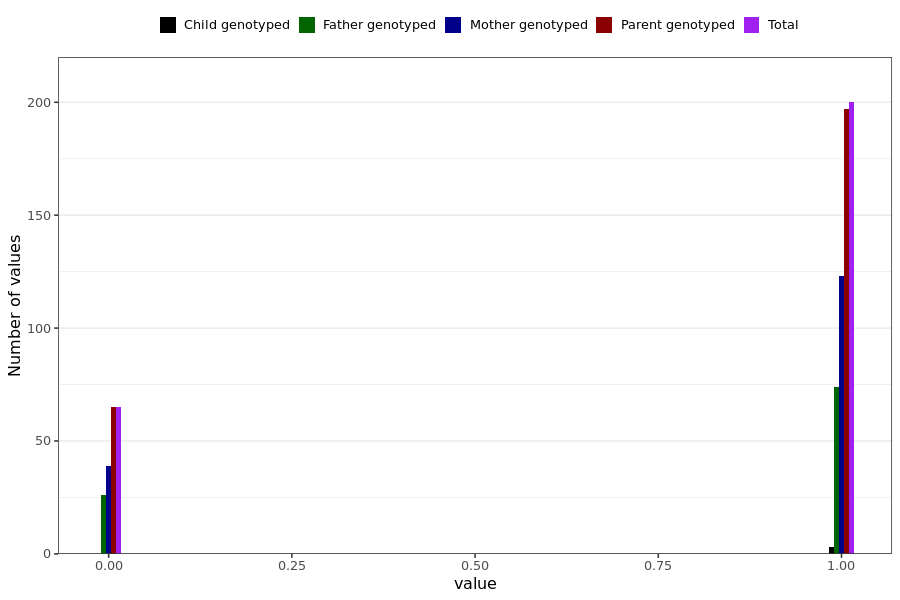

# lung_function_reduced_short
- Number of values:

| Value | Total | Child genotyped | Mother genotyped | Father genotyped | Parents genotyped |
| ----- | ----- | --------------- | ---------------- | ---------------- |---------------- |
| Missing | 230724 | 83467 | 87483 | 59774 | 147257 |
| Non-missing | 265 | 3 | 162 | 100 | 262 |

| Value | Total | Child genotyped | Mother genotyped | Father genotyped | Parents genotyped |
| ----- | ----- | --------------- | ---------------- | ---------------- |---------------- |
| 0 | 65 | 0 | 39 | 26 | 65 |
| 1 | 200 | 3 | 123 | 74 | 197 |

