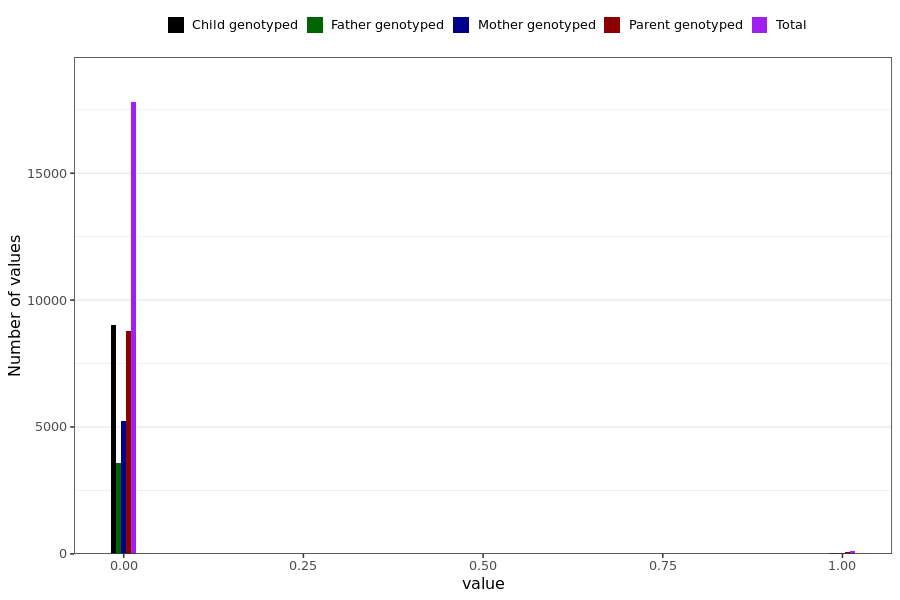

# msis_hospitalized
- Number of values:

| Value | Total | Child genotyped | Mother genotyped | Father genotyped | Parents genotyped |
| ----- | ----- | --------------- | ---------------- | ---------------- |---------------- |
| Missing | 213091 | 74445 | 82374 | 56272 | 138646 |
| Non-missing | 17898 | 9025 | 5271 | 3602 | 8873 |

| Value | Total | Child genotyped | Mother genotyped | Father genotyped | Parents genotyped |
| ----- | ----- | --------------- | ---------------- | ---------------- |---------------- |
| 0 | 17795 | 9003 | 5228 | 3564 | 8792 |
| 1 | 103 | 22 | 43 | 38 | 81 |

