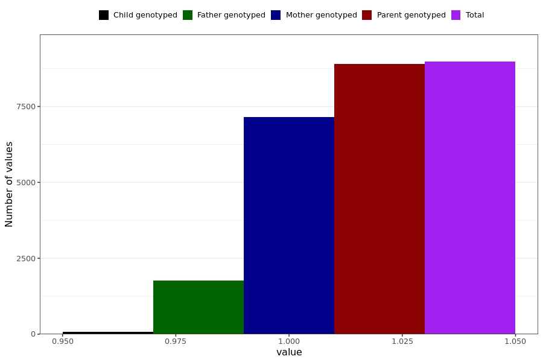

# poor_memory
- Number of values:

| Value | Total | Child genotyped | Mother genotyped | Father genotyped | Parents genotyped |
| ----- | ----- | --------------- | ---------------- | ---------------- |---------------- |
| Missing | 222014 | 83403 | 80495 | 58116 | 138611 |
| Non-missing | 8975 | 67 | 7150 | 1758 | 8908 |

| Value | Total | Child genotyped | Mother genotyped | Father genotyped | Parents genotyped |
| ----- | ----- | --------------- | ---------------- | ---------------- |---------------- |
| 1 | 8975 | 67 | 7150 | 1758 | 8908 |

