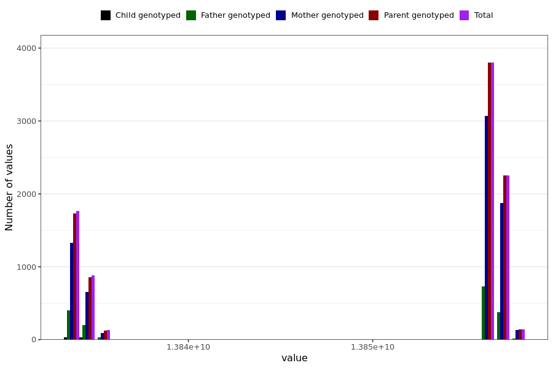

# poor_memory_last_reported
- Number of values:

| Value | Total | Child genotyped | Mother genotyped | Father genotyped | Parents genotyped |
| ----- | ----- | --------------- | ---------------- | ---------------- |---------------- |
| Missing | 222014 | 83403 | 80495 | 58116 | 138611 |
| Non-missing | 8975 | 67 | 7150 | 1758 | 8908 |

| Value | Total | Child genotyped | Mother genotyped | Father genotyped | Parents genotyped |
| ----- | ----- | --------------- | ---------------- | ---------------- |---------------- |
| 25th percentile | 13834713600 | 13834022400 | 13834886400 | 13834108800 | 13834886400 |
| 50th percentile | 13856572800 | 13834022400 | 13856572800 | 13856572800 | 13856572800 |
| 75th percentile | 13856659200 | 13834886400 | 13856659200 | 13856572800 | 13856659200 |

