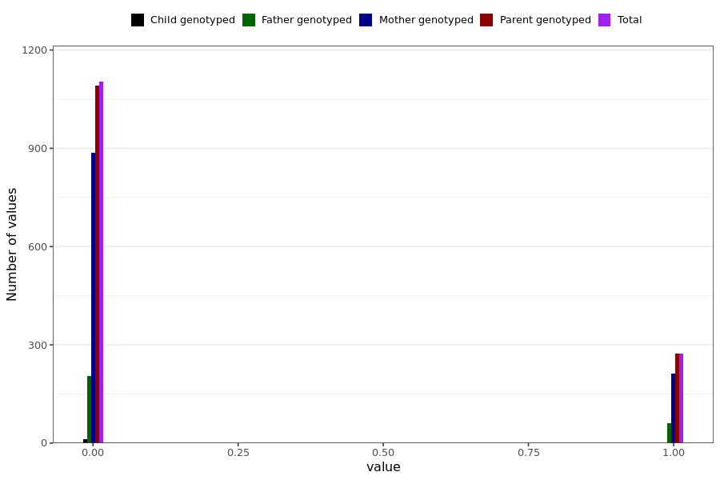

# poor_memory_long
- Number of values:

| Value | Total | Child genotyped | Mother genotyped | Father genotyped | Parents genotyped |
| ----- | ----- | --------------- | ---------------- | ---------------- |---------------- |
| Missing | 229613 | 83458 | 86546 | 59609 | 146155 |
| Non-missing | 1376 | 12 | 1099 | 265 | 1364 |

| Value | Total | Child genotyped | Mother genotyped | Father genotyped | Parents genotyped |
| ----- | ----- | --------------- | ---------------- | ---------------- |---------------- |
| 0 | 1103 | 12 | 886 | 205 | 1091 |
| 1 | 273 | 0 | 213 | 60 | 273 |

