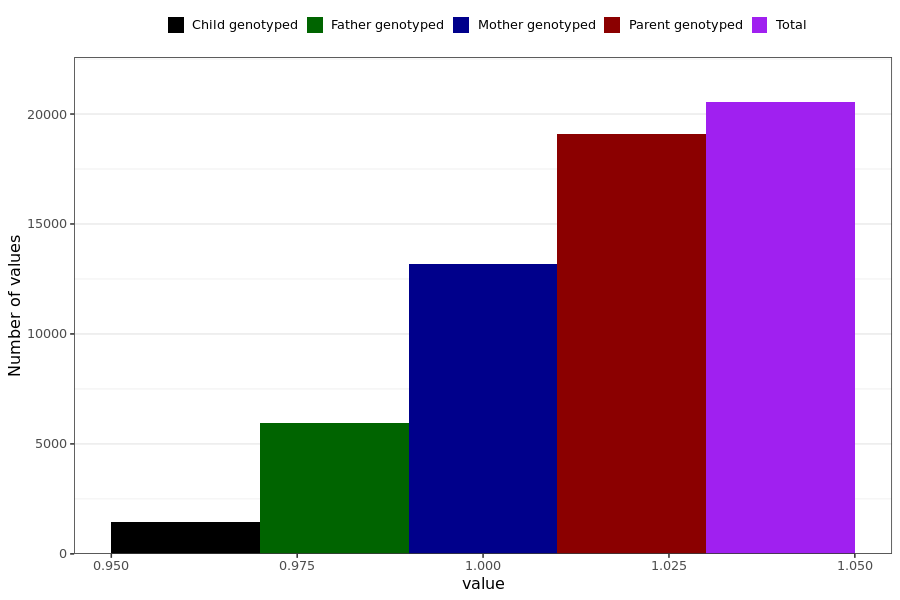

# reduced_smell_taste
- Number of values:

| Value | Total | Child genotyped | Mother genotyped | Father genotyped | Parents genotyped |
| ----- | ----- | --------------- | ---------------- | ---------------- |---------------- |
| Missing | 210456 | 82032 | 74480 | 53944 | 128424 |
| Non-missing | 20533 | 1438 | 13165 | 5930 | 19095 |

| Value | Total | Child genotyped | Mother genotyped | Father genotyped | Parents genotyped |
| ----- | ----- | --------------- | ---------------- | ---------------- |---------------- |
| 1 | 20533 | 1438 | 13165 | 5930 | 19095 |

