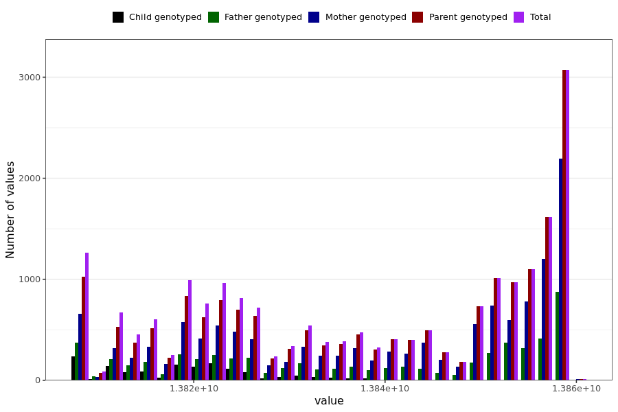

# reduced_smell_taste_last_reported
- Number of values:

| Value | Total | Child genotyped | Mother genotyped | Father genotyped | Parents genotyped |
| ----- | ----- | --------------- | ---------------- | ---------------- |---------------- |
| Missing | 210456 | 82032 | 74480 | 53944 | 128424 |
| Non-missing | 20533 | 1438 | 13165 | 5930 | 19095 |

| Value | Total | Child genotyped | Mother genotyped | Father genotyped | Parents genotyped |
| ----- | ----- | --------------- | ---------------- | ---------------- |---------------- |
| 25th percentile | 13822012800 | 13812336000 | 13823395200 | 13822012800 | 13823136000 |
| 50th percentile | 13840070400 | 13819593600 | 13844390400 | 13838947200 | 13842662400 |
| 75th percentile | 13854758400 | 13823740800 | 13856572800 | 13854672000 | 13855147200 |

