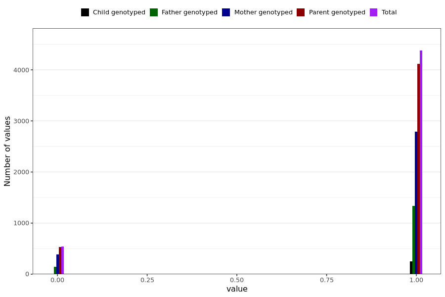

# reduced_smell_taste_short
- Number of values:

| Value | Total | Child genotyped | Mother genotyped | Father genotyped | Parents genotyped |
| ----- | ----- | --------------- | ---------------- | ---------------- |---------------- |
| Missing | 226076 | 83212 | 84470 | 58394 | 142864 |
| Non-missing | 4913 | 258 | 3175 | 1480 | 4655 |

| Value | Total | Child genotyped | Mother genotyped | Father genotyped | Parents genotyped |
| ----- | ----- | --------------- | ---------------- | ---------------- |---------------- |
| 0 | 537 | 3 | 390 | 144 | 534 |
| 1 | 4376 | 255 | 2785 | 1336 | 4121 |

