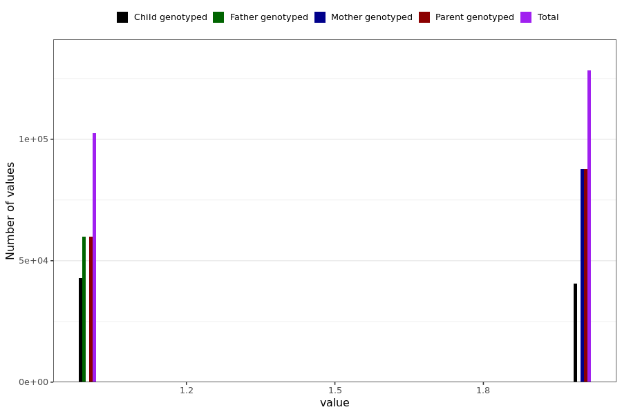

# sex
- Number of values:

| Value | Total | Child genotyped | Mother genotyped | Father genotyped | Parents genotyped |
| ----- | ----- | --------------- | ---------------- | ---------------- |---------------- |
| Missing | 66 | 66 | 0 | 0 | 0 |
| Non-missing | 230923 | 83404 | 87645 | 59874 | 147519 |

| Value | Total | Child genotyped | Mother genotyped | Father genotyped | Parents genotyped |
| ----- | ----- | --------------- | ---------------- | ---------------- |---------------- |
| 1 | 102647 | 42773 | 0 | 59874 | 59874 |
| 2 | 128276 | 40631 | 87645 | 0 | 87645 |

