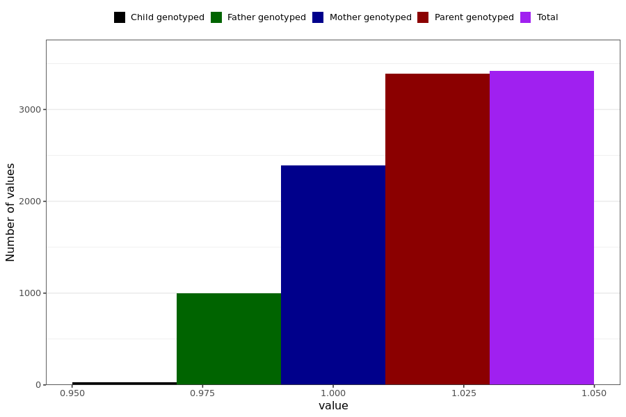

# shortness_breath
- Number of values:

| Value | Total | Child genotyped | Mother genotyped | Father genotyped | Parents genotyped |
| ----- | ----- | --------------- | ---------------- | ---------------- |---------------- |
| Missing | 227571 | 83441 | 85254 | 58876 | 144130 |
| Non-missing | 3418 | 29 | 2391 | 998 | 3389 |

| Value | Total | Child genotyped | Mother genotyped | Father genotyped | Parents genotyped |
| ----- | ----- | --------------- | ---------------- | ---------------- |---------------- |
| 1 | 3418 | 29 | 2391 | 998 | 3389 |

