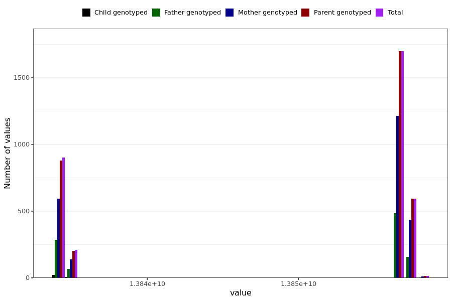

# shortness_breath_last_reported
- Number of values:

| Value | Total | Child genotyped | Mother genotyped | Father genotyped | Parents genotyped |
| ----- | ----- | --------------- | ---------------- | ---------------- |---------------- |
| Missing | 227571 | 83441 | 85254 | 58876 | 144130 |
| Non-missing | 3418 | 29 | 2391 | 998 | 3389 |

| Value | Total | Child genotyped | Mother genotyped | Father genotyped | Parents genotyped |
| ----- | ----- | --------------- | ---------------- | ---------------- |---------------- |
| 25th percentile | 13834195200 | 13834022400 | 13834713600 | 13834108800 | 13834195200 |
| 50th percentile | 13856572800 | 13834022400 | 13856572800 | 13856572800 | 13856572800 |
| 75th percentile | 13856659200 | 13834108800 | 13856659200 | 13856572800 | 13856659200 |

