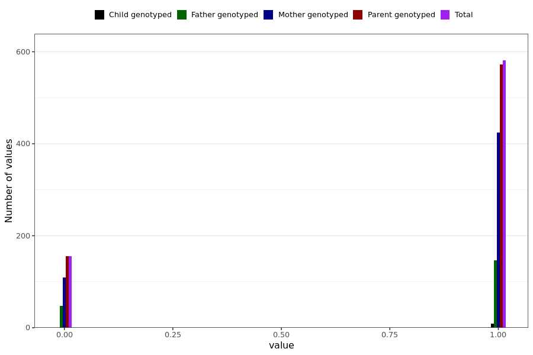

# shortness_breath_short
- Number of values:

| Value | Total | Child genotyped | Mother genotyped | Father genotyped | Parents genotyped |
| ----- | ----- | --------------- | ---------------- | ---------------- |---------------- |
| Missing | 230252 | 83461 | 87111 | 59680 | 146791 |
| Non-missing | 737 | 9 | 534 | 194 | 728 |

| Value | Total | Child genotyped | Mother genotyped | Father genotyped | Parents genotyped |
| ----- | ----- | --------------- | ---------------- | ---------------- |---------------- |
| 0 | 156 | 0 | 109 | 47 | 156 |
| 1 | 581 | 9 | 425 | 147 | 572 |

