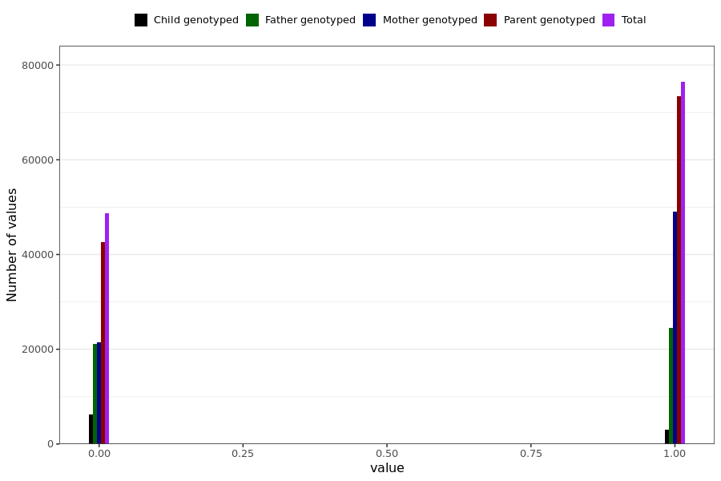

# sick_past_14_days
- Number of values:

| Value | Total | Child genotyped | Mother genotyped | Father genotyped | Parents genotyped |
| ----- | ----- | --------------- | ---------------- | ---------------- |---------------- |
| Missing | 105792 | 74323 | 17199 | 14270 | 31469 |
| Non-missing | 125197 | 9147 | 70446 | 45604 | 116050 |

| Value | Total | Child genotyped | Mother genotyped | Father genotyped | Parents genotyped |
| ----- | ----- | --------------- | ---------------- | ---------------- |---------------- |
| 0 | 48785 | 6165 | 21466 | 21154 | 42620 |
| 1 | 76412 | 2982 | 48980 | 24450 | 73430 |

