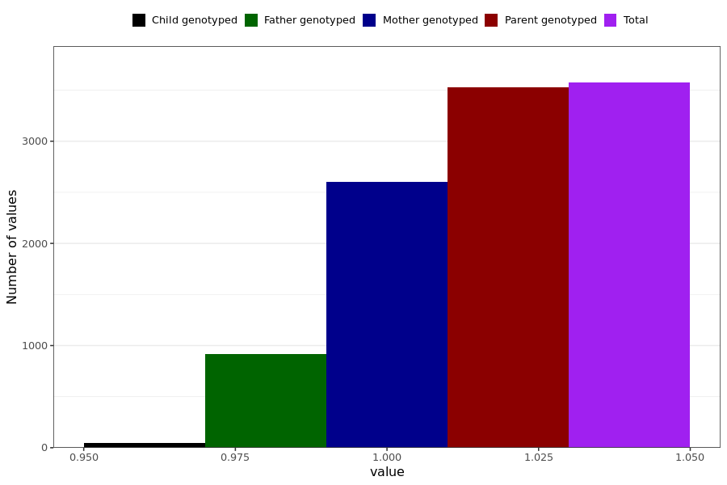

# skin_rash
- Number of values:

| Value | Total | Child genotyped | Mother genotyped | Father genotyped | Parents genotyped |
| ----- | ----- | --------------- | ---------------- | ---------------- |---------------- |
| Missing | 227416 | 83421 | 85039 | 58956 | 143995 |
| Non-missing | 3573 | 49 | 2606 | 918 | 3524 |

| Value | Total | Child genotyped | Mother genotyped | Father genotyped | Parents genotyped |
| ----- | ----- | --------------- | ---------------- | ---------------- |---------------- |
| 1 | 3573 | 49 | 2606 | 918 | 3524 |

