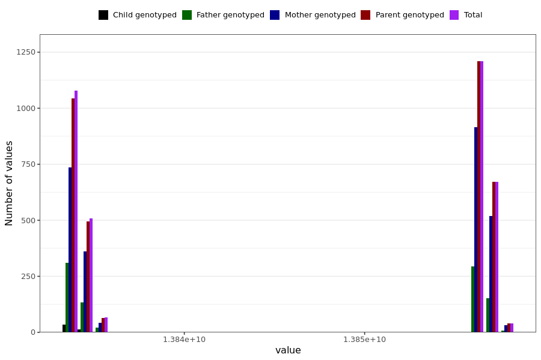

# skin_rash_last_reported
- Number of values:

| Value | Total | Child genotyped | Mother genotyped | Father genotyped | Parents genotyped |
| ----- | ----- | --------------- | ---------------- | ---------------- |---------------- |
| Missing | 227416 | 83421 | 85039 | 58956 | 143995 |
| Non-missing | 3573 | 49 | 2606 | 918 | 3524 |

| Value | Total | Child genotyped | Mother genotyped | Father genotyped | Parents genotyped |
| ----- | ----- | --------------- | ---------------- | ---------------- |---------------- |
| 25th percentile | 13834022400 | 13834022400 | 13834022400 | 13834022400 | 13834022400 |
| 50th percentile | 13856572800 | 13834022400 | 13856572800 | 13835102400 | 13856572800 |
| 75th percentile | 13856572800 | 13834108800 | 13856572800 | 13856572800 | 13856572800 |

