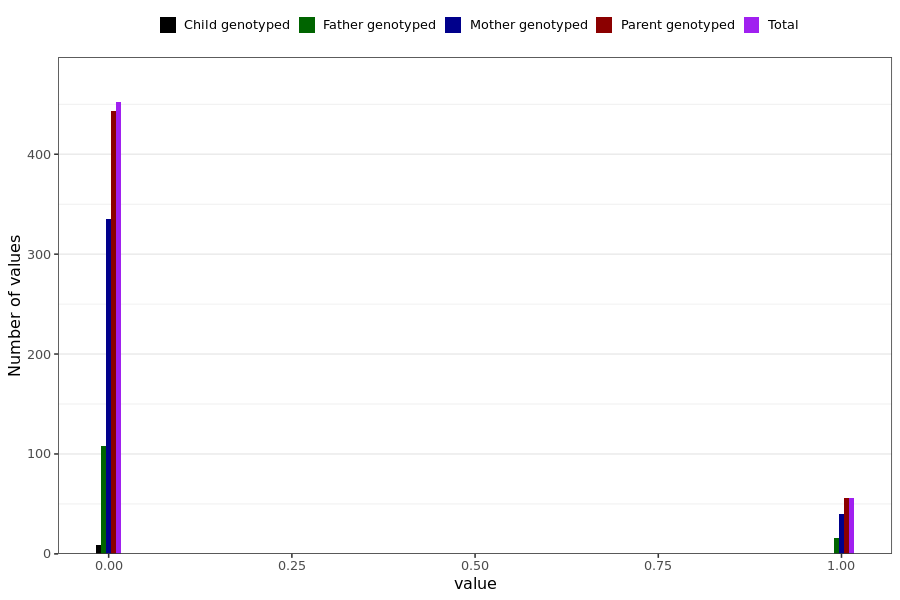

# skin_rash_long
- Number of values:

| Value | Total | Child genotyped | Mother genotyped | Father genotyped | Parents genotyped |
| ----- | ----- | --------------- | ---------------- | ---------------- |---------------- |
| Missing | 230481 | 83461 | 87270 | 59750 | 147020 |
| Non-missing | 508 | 9 | 375 | 124 | 499 |

| Value | Total | Child genotyped | Mother genotyped | Father genotyped | Parents genotyped |
| ----- | ----- | --------------- | ---------------- | ---------------- |---------------- |
| 0 | 452 | 9 | 335 | 108 | 443 |
| 1 | 56 | 0 | 40 | 16 | 56 |

