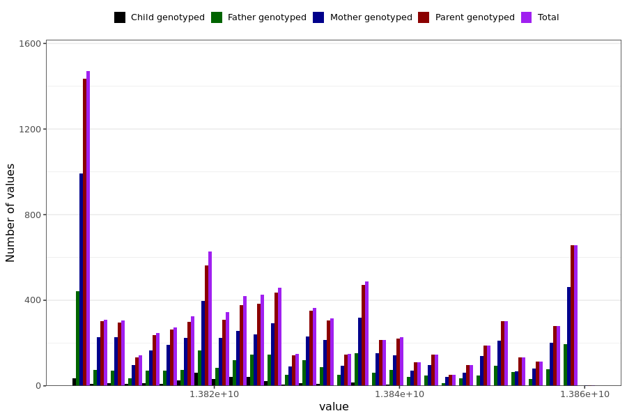

# suspected_or_confirmed_covid_doctor_past_14_days_last_reported
- Number of values:

| Value | Total | Child genotyped | Mother genotyped | Father genotyped | Parents genotyped |
| ----- | ----- | --------------- | ---------------- | ---------------- |---------------- |
| Missing | 221653 | 83107 | 81430 | 57116 | 138546 |
| Non-missing | 9336 | 363 | 6215 | 2758 | 8973 |

| Value | Total | Child genotyped | Mother genotyped | Father genotyped | Parents genotyped |
| ----- | ----- | --------------- | ---------------- | ---------------- |---------------- |
| 25th percentile | 13812660000 | 13815964800 | 13812336000 | 13813740000 | 13812336000 |
| 50th percentile | 13824432000 | 13820112000 | 13824432000 | 13825641600 | 13824604800 |
| 75th percentile | 13838169600 | 13824432000 | 13838947200 | 13839033600 | 13838947200 |

