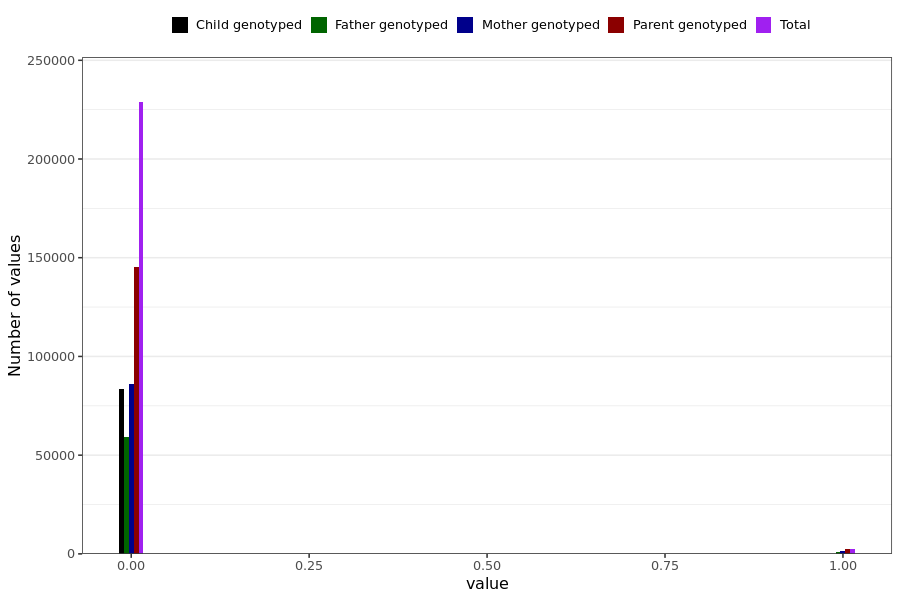

# tested_positive
- Number of values:

| Value | Total | Child genotyped | Mother genotyped | Father genotyped | Parents genotyped |
| ----- | ----- | --------------- | ---------------- | ---------------- |---------------- |
| Missing | 0 | 0 | 0 | 0 | 0 |
| Non-missing | 230989 | 83470 | 87645 | 59874 | 147519 |

| Value | Total | Child genotyped | Mother genotyped | Father genotyped | Parents genotyped |
| ----- | ----- | --------------- | ---------------- | ---------------- |---------------- |
| 0 | 228724 | 83424 | 86244 | 59056 | 145300 |
| 1 | 2265 | 46 | 1401 | 818 | 2219 |

