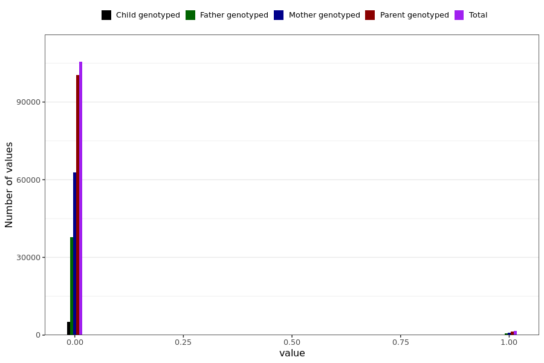

# tested_positive_ab
- Number of values:

| Value | Total | Child genotyped | Mother genotyped | Father genotyped | Parents genotyped |
| ----- | ----- | --------------- | ---------------- | ---------------- |---------------- |
| Missing | 123996 | 78423 | 23963 | 21610 | 45573 |
| Non-missing | 106993 | 5047 | 63682 | 38264 | 101946 |

| Value | Total | Child genotyped | Mother genotyped | Father genotyped | Parents genotyped |
| ----- | ----- | --------------- | ---------------- | ---------------- |---------------- |
| 0 | 105496 | 5013 | 62776 | 37707 | 100483 |
| 1 | 1497 | 34 | 906 | 557 | 1463 |

