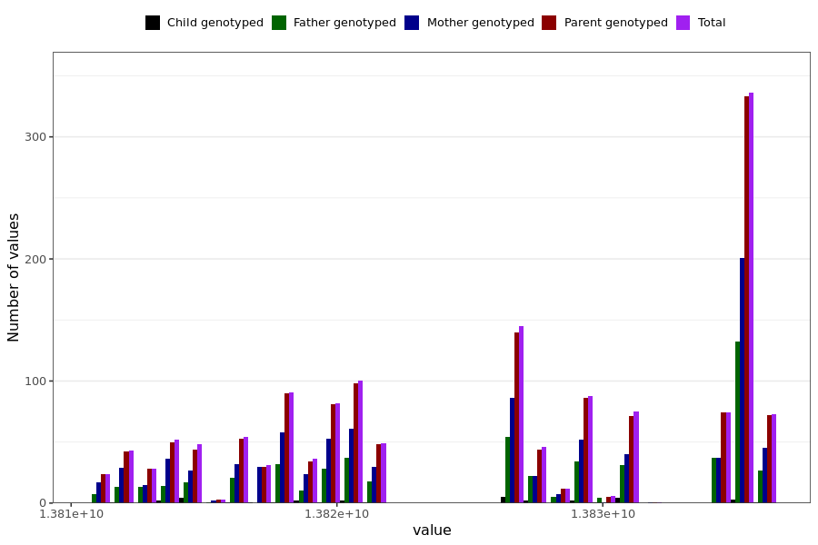

# tested_positive_ab_last_reported
- Number of values:

| Value | Total | Child genotyped | Mother genotyped | Father genotyped | Parents genotyped |
| ----- | ----- | --------------- | ---------------- | ---------------- |---------------- |
| Missing | 229492 | 83436 | 86739 | 59317 | 146056 |
| Non-missing | 1497 | 34 | 906 | 557 | 1463 |

| Value | Total | Child genotyped | Mother genotyped | Father genotyped | Parents genotyped |
| ----- | ----- | --------------- | ---------------- | ---------------- |---------------- |
| 25th percentile | 13818470400 | 13817455200 | 13818297600 | 13819593600 | 13818513600 |
| 50th percentile | 13826764800 | 13826851200 | 13826764800 | 13827888000 | 13826764800 |
| 75th percentile | 13835318400 | 13829702400 | 13834886400 | 13835318400 | 13835318400 |

