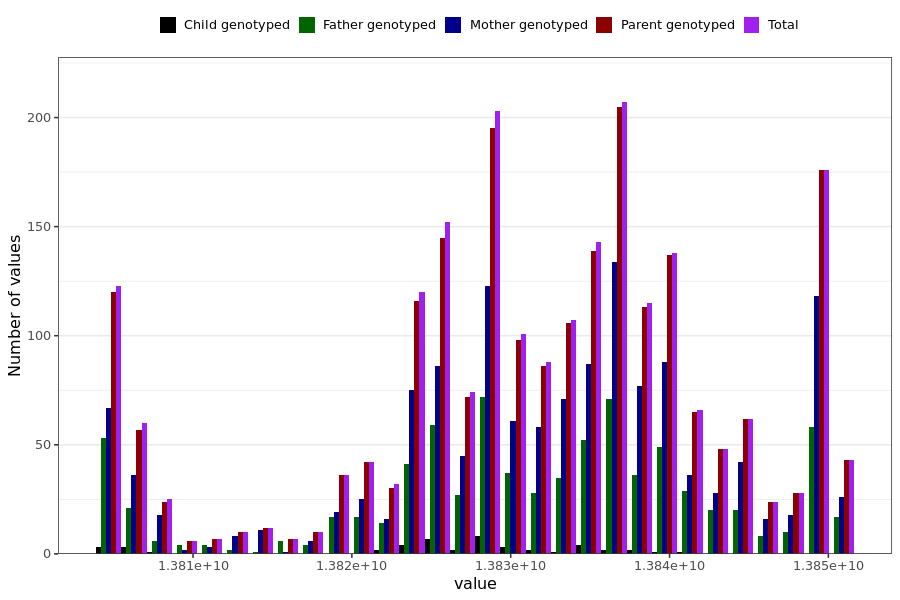

# tested_positive_last_reported
- Number of values:

| Value | Total | Child genotyped | Mother genotyped | Father genotyped | Parents genotyped |
| ----- | ----- | --------------- | ---------------- | ---------------- |---------------- |
| Missing | 228724 | 83424 | 86244 | 59056 | 145300 |
| Non-missing | 2265 | 46 | 1401 | 818 | 2219 |

| Value | Total | Child genotyped | Mother genotyped | Father genotyped | Parents genotyped |
| ----- | ----- | --------------- | ---------------- | ---------------- |---------------- |
| 25th percentile | 13825641600 | 13824432000 | 13825641600 | 13825641600 | 13825641600 |
| 50th percentile | 13832899200 | 13827888000 | 13834022400 | 13831732800 | 13832899200 |
| 75th percentile | 13838947200 | 13831905600 | 13838947200 | 13838947200 | 13838947200 |

