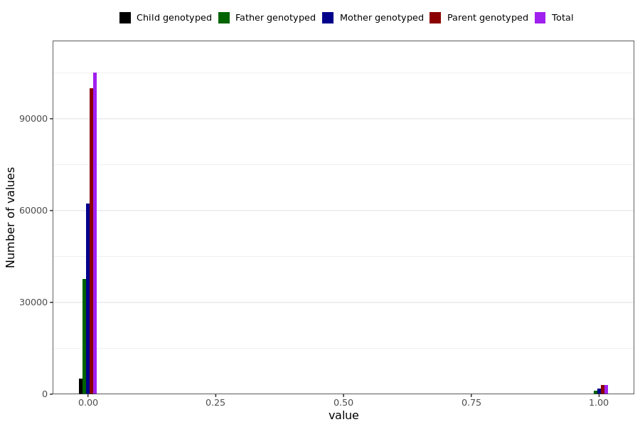

# tested_positive_pcr
- Number of values:

| Value | Total | Child genotyped | Mother genotyped | Father genotyped | Parents genotyped |
| ----- | ----- | --------------- | ---------------- | ---------------- |---------------- |
| Missing | 123008 | 78340 | 23508 | 21160 | 44668 |
| Non-missing | 107981 | 5130 | 64137 | 38714 | 102851 |

| Value | Total | Child genotyped | Mother genotyped | Father genotyped | Parents genotyped |
| ----- | ----- | --------------- | ---------------- | ---------------- |---------------- |
| 0 | 105012 | 5077 | 62308 | 37627 | 99935 |
| 1 | 2969 | 53 | 1829 | 1087 | 2916 |

