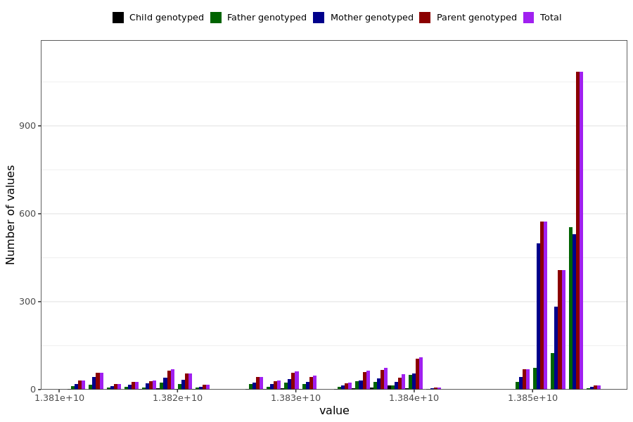

# tested_positive_pcr_last_reported
- Number of values:

| Value | Total | Child genotyped | Mother genotyped | Father genotyped | Parents genotyped |
| ----- | ----- | --------------- | ---------------- | ---------------- |---------------- |
| Missing | 228020 | 83417 | 85816 | 58787 | 144603 |
| Non-missing | 2969 | 53 | 1829 | 1087 | 2916 |

| Value | Total | Child genotyped | Mother genotyped | Father genotyped | Parents genotyped |
| ----- | ----- | --------------- | ---------------- | ---------------- |---------------- |
| 25th percentile | 13840070400 | 13826851200 | 13840675200 | 13840070400 | 13840221600 |
| 50th percentile | 13851388800 | 13835318400 | 13851129600 | 13853462400 | 13851475200 |
| 75th percentile | 13853462400 | 13838947200 | 13853462400 | 13853462400 | 13853462400 |

