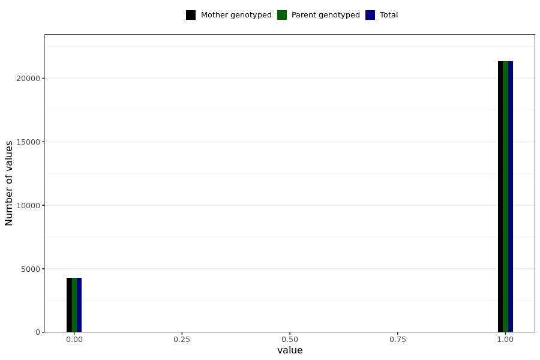

# unexpected_abdominal_bleeding
- Number of values:

| Value | Total | Child genotyped | Mother genotyped | Father genotyped | Parents genotyped |
| ----- | ----- | --------------- | ---------------- | ---------------- |---------------- |
| Missing | 205368 | 83470 | 62024 | 59874 | 121898 |
| Non-missing | 25621 | 0 | 25621 | 0 | 25621 |

| Value | Total | Child genotyped | Mother genotyped | Father genotyped | Parents genotyped |
| ----- | ----- | --------------- | ---------------- | ---------------- |---------------- |
| 0 | 4294 | 0 | 4294 | 0 | 4294 |
| 1 | 21327 | 0 | 21327 | 0 | 21327 |

