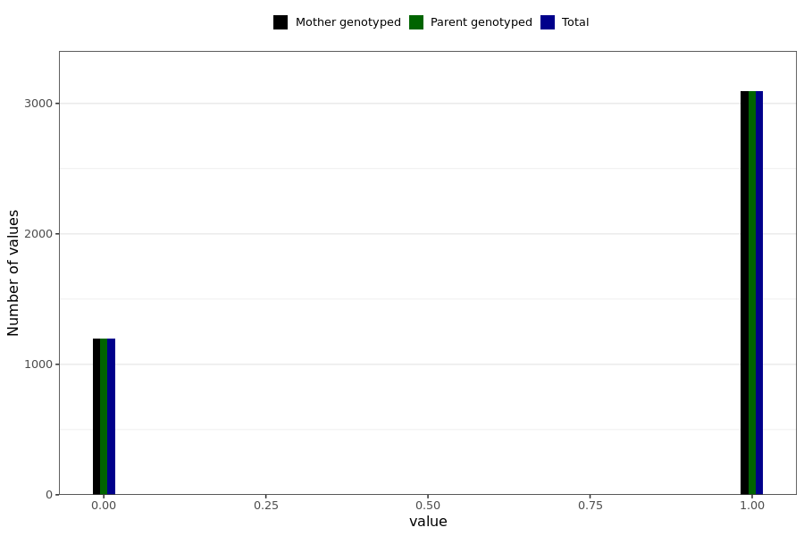

# unexpected_abdominal_bleeding_menstruation_disturbance_still
- Number of values:

| Value | Total | Child genotyped | Mother genotyped | Father genotyped | Parents genotyped |
| ----- | ----- | --------------- | ---------------- | ---------------- |---------------- |
| Missing | 226699 | 83470 | 83355 | 59874 | 143229 |
| Non-missing | 4290 | 0 | 4290 | 0 | 4290 |

| Value | Total | Child genotyped | Mother genotyped | Father genotyped | Parents genotyped |
| ----- | ----- | --------------- | ---------------- | ---------------- |---------------- |
| 0 | 1198 | 0 | 1198 | 0 | 1198 |
| 1 | 3092 | 0 | 3092 | 0 | 3092 |

