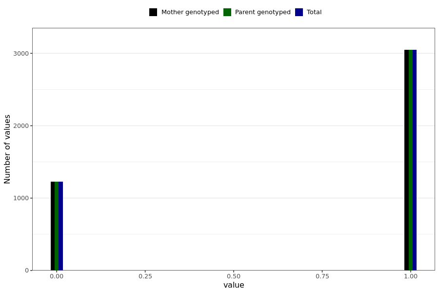

# unexpected_abdominal_bleeding_strong
- Number of values:

| Value | Total | Child genotyped | Mother genotyped | Father genotyped | Parents genotyped |
| ----- | ----- | --------------- | ---------------- | ---------------- |---------------- |
| Missing | 226717 | 83470 | 83373 | 59874 | 143247 |
| Non-missing | 4272 | 0 | 4272 | 0 | 4272 |

| Value | Total | Child genotyped | Mother genotyped | Father genotyped | Parents genotyped |
| ----- | ----- | --------------- | ---------------- | ---------------- |---------------- |
| 0 | 1225 | 0 | 1225 | 0 | 1225 |
| 1 | 3047 | 0 | 3047 | 0 | 3047 |

